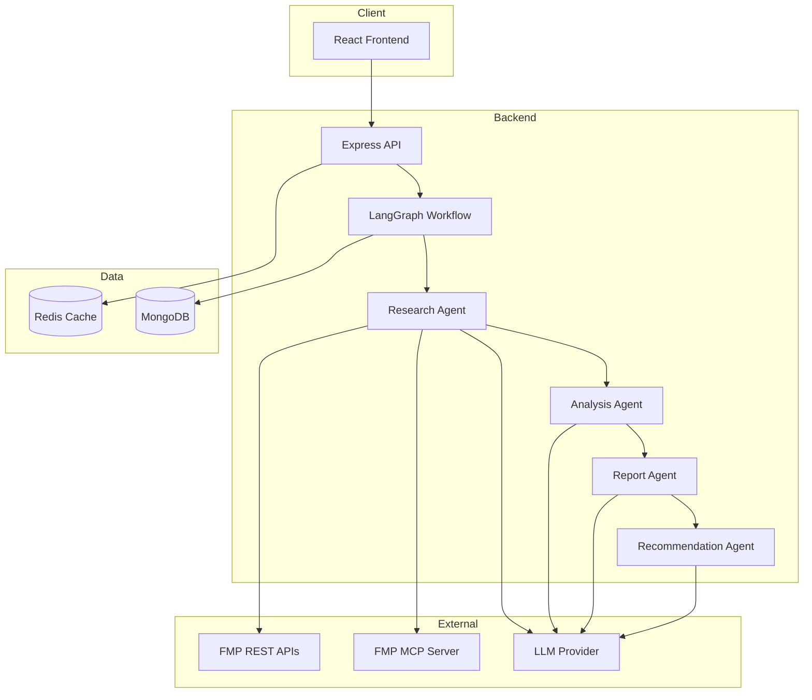

# AI Investment Research Agent

An end-to-end AI-powered investment research platform that autonomously researches companies and produces professional **BUY / HOLD / PASS** recommendations with confidence scores and detailed reports.

> **Status:** Module 1 complete — project scaffold & backend core infrastructure.

---

## Overview

Users enter a company name. A LangGraph-orchestrated multi-agent pipeline:

1. **Researches** the company (FMP APIs + MCP wrapper)
2. **Analyzes** financial health, sentiment, and technicals
3. **Generates** a professional investment report
4. **Recommends** BUY, HOLD, or PASS

Results are cached in **Redis** and persisted in **MongoDB**.

---

## Architecture



---

## Folder Structure

```
AI-Investment-Agent/
├── backend/
│   └── src/
│       ├── agents/          # LangGraph agent nodes (upcoming)
│       ├── graph/           # Workflow definition & shared state (upcoming)
│       ├── tools/           # FMP & MCP data retrieval tools (upcoming)
│       ├── prompts/         # LLM prompt templates (upcoming)
│       ├── controllers/     # HTTP request handlers (upcoming)
│       ├── routes/          # Express route definitions (upcoming)
│       ├── services/        # Business logic layer (upcoming)
│       ├── models/          # MongoDB schemas (upcoming)
│       ├── middleware/      # Error handling, validation, rate limiting
│       ├── config/          # Environment, DB, Redis
│       └── utils/           # Logger, errors, retry, helpers
├── frontend/                # React + Vite dashboard (upcoming)
├── docker-compose.yml
├── .env.example
└── README.md
```

---

## Tech Stack

| Layer      | Technology                          |
|------------|-------------------------------------|
| Frontend   | React, Vite, Tailwind, React Query  |
| Backend    | Node.js, Express                    |
| AI         | LangGraph.js, LangChain.js          |
| Database   | MongoDB                             |
| Cache      | Redis (allkeys-lfu)                 |
| Financial  | FMP REST APIs, FMP MCP Server       |
| Deployment | Docker, Docker Compose              |

---

## Installation

### Prerequisites

- Node.js 20+
- Docker & Docker Compose (recommended)
- FMP API key

### Quick Start

```bash
# 1. Clone and configure
cp .env.example .env
# Edit .env with your API keys

# 2. Start infrastructure (MongoDB + Redis)
docker compose up mongodb redis -d

# 3. Install and run backend
cd backend
npm install
npm run dev
```

Verify: `GET http://localhost:5000/api/health`

---

## Environment Variables

| Variable              | Description                          | Required |
|-----------------------|--------------------------------------|----------|
| `PORT`                | Backend server port                  | No (5000)|
| `CLIENT_URL`          | Frontend origin for CORS             | No       |
| `MONGODB_URI`         | MongoDB connection string            | Yes      |
| `REDIS_URL`           | Redis connection string              | Yes      |
| `REDIS_TTL_SECONDS`   | Cache TTL for completed research     | No       |
| `FMP_API_KEY`         | Financial Modeling Prep API key      | Later    |
| `FMP_MCP_SERVER_URL`  | FMP MCP server endpoint              | Later    |
| `FMP_MCP_API_KEY`     | FMP MCP authentication               | Later    |
| `LLM_PROVIDER`        | LLM provider identifier              | Later    |
| `LLM_API_KEY`         | LLM API key                          | Later    |

---

## Module Roadmap

| # | Module                              | Status      |
|---|-------------------------------------|-------------|
| 1 | Project scaffold & backend core     | ✅ Complete |
| 2 | Shared graph state & LangGraph setup  | Pending     |
| 3 | FMP tools (Profile, News, Technical)  | Pending     |
| 4 | Research MCP wrapper & Data Cleaning  | Pending     |
| 5 | Research Agent                        | Pending     |
| 6 | Analysis, Report, Recommendation Agents | Pending   |
| 7 | MongoDB models & Redis cache service  | Pending     |
| 8 | API routes & controllers              | Pending     |
| 9 | React frontend                        | Pending     |
| 10| Docker full-stack & final README      | Pending     |

---

## Docker Instructions

```bash
# Infrastructure only (development)
docker compose up mongodb redis -d

# Full stack (after frontend module)
docker compose --profile full up -d
```

Redis is configured with `allkeys-lfu` eviction policy as specified.

---

## Engineering Principles

- **Agents reason** — tools retrieve data, services implement business logic
- **Structured JSON state** — agents never communicate via free-form text
- **Repository pattern** — data access isolated from business logic
- **Fail fast** — environment validated at startup via Zod
- **Graceful shutdown** — clean disconnect from MongoDB and Redis

---

*More sections (AI workflow, caching strategy, database design, tradeoffs) will be added as modules are completed.*
