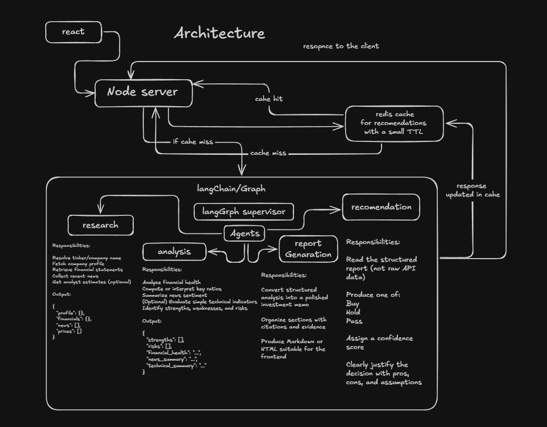

# AI Investment Research Agent

> A multi-agent LLM pipeline that autonomously researches, analyses, and generates professional-grade equity investment reports from a single company name.

---

## Overview

**AI Research Agent** is a full-stack, production-deployed application that orchestrates four specialised AI agents using [LangGraph](https://langchain-ai.github.io/langgraph/) to produce comprehensive investment dossiers on any publicly traded company.

A user types a company name (e.g. "Apple" or "Tesla") into the web interface. The system:

1. **Resolves** the raw company name to a verified stock ticker symbol.
2. **Researches** the company in a self-directing loop — fetching financial statements, technical indicators, and real-time news, asking the LLM whether evidence is sufficient, and requesting more data if not.
3. **Analyses** the gathered data into a structured SWOT matrix, financial sub-scores, sentiment breakdown, and a 0–100 composite investment attractiveness score.
4. **Compiles** a publication-ready Markdown + styled HTML investment report.
5. **Delivers** a final BUY / HOLD / PASS recommendation with confidence score and investment horizon, justified by structured reasoning.

All five stages run asynchronously in the background — the frontend polls for updates and renders the live dossier in a dark-themed, glassmorphism UI.

---

## How to Run It

### Prerequisites

- Node.js ≥ 20
- MongoDB (Atlas free tier or local)
- Redis (Redis Cloud free tier or local Docker)
- API keys for:
  - **FMP** (Financial Modelling Prep) — market data — [financialmodelingprep.com](https://financialmodelingprep.com/developer/docs)
  - **Tavily** — real-time news web search — [app.tavily.com](https://app.tavily.com)
  - **LLM Provider** — one of:
    - Google Gemini: [aistudio.google.com](https://aistudio.google.com) *(recommended, generous free tier)*
    - Groq: [console.groq.com](https://console.groq.com) *(fast, but limited daily tokens)*
    - OpenAI: [platform.openai.com](https://platform.openai.com) *(paid)*
    - Anthropic: [console.anthropic.com](https://console.anthropic.com) *(paid)*

---

### 1. Clone the Repository

```bash
git clone https://github.com/Kancharana-Tanay/AI-Research-Agent.git
cd AI-Research-Agent
```

---

### 2. Configure Environment Variables

Copy and fill in `backend/.env`:

```env
# Server
PORT=5000
NODE_ENV=development
CLIENT_URL=http://localhost:5173

# Database
MONGODB_URI=mongodb://localhost:27017/ai-investment-agent

# Cache
REDIS_URL=redis://localhost:6379
REDIS_TTL_SECONDS=3600

# Financial Modeling Prep
FMP_API_KEY=your-fmp-api-key-here

# LLM — pick ONE provider
# Supported: google | groq | openai | anthropic
LLM_PROVIDER=google
LLM_API_KEY=your-google-ai-studio-key-here
LLM_MODEL=gemini-1.5-flash

# News Search (Tavily)
TAVILY_API_KEY=your-tavily-key-here

# Rate Limiting
RATE_LIMIT_WINDOW_MS=900000
RATE_LIMIT_MAX_REQUESTS=100
```

Create `frontend/.env.local`:

```env
VITE_API_URL=http://localhost:5000/api
```

---

### 3. Install Dependencies & Run

**Backend:**
```bash
cd backend
npm install
npm run dev
```

**Frontend** (in a separate terminal):
```bash
cd frontend
npm install
npm run dev
```

Open [http://localhost:5173](http://localhost:5173) and type a company name to begin.

---

### 4. Redis (optional but recommended)

Redis is used for caching FMP API responses. The app runs gracefully without it — caching is simply bypassed.

**Quick start with Docker:**
```bash
docker run -d -p 6379:6379 redis:alpine
```

---

### Deployment (Cloud)

| Service | Provider |
|---|---|
| Frontend | [Vercel](https://vercel.com) — Root: `frontend`, Framework: Vite |
| Backend | [Render](https://render.com) — Root: `backend`, Start: `npm start` |
| MongoDB | [MongoDB Atlas](https://mongodb.com/atlas) — Free M0 cluster |
| Redis | [Redis Cloud](https://redis.io/try-free/) — Free 30MB tier |

Set `VITE_API_URL` to your Render backend URL (e.g. `https://your-service.onrender.com/api`) in Vercel's environment variables.

---

## My first Architecture
---



---

## Final Architecture (How It works)

### Pipeline Overview

```
User Input
    │
    ▼
[ResearchAgent] ◄─────────────────────────────────┐
    │                                              │
    ├─ Resolves ticker via FMP name-search         │
    ├─ Fetches: profile, technicals, Tavily news   │
    ├─ Asks LLM: "Is evidence sufficient?"         │
    ├─ If NO → fetches Income / Balance / Cash     │
    │          Flow / Ratios etc. one at a time    │
    └─ If YES (or cap hit) → data cleaning ────────┘
                │
                ▼
        [AnalysisAgent]
            │
            ├─ Financial health sub-scores (0–10 each)
            ├─ News sentiment breakdown (–1 to +1)
            ├─ Technical outlook (trend, RSI, SMAs)
            ├─ SWOT: strengths, weaknesses, risks, growth
            └─ Composite investment score (0–100)
                │
                ▼
          [ReportAgent]
            │
            ├─ Drafts section texts (executive summary,
            │  financial analysis, investment thesis, etc.)
            ├─ Compiles full GitHub Markdown document
            └─ Generates styled inline-CSS HTML report
                │
                ▼
    [RecommendationAgent]
            │
            └─ Final BUY / HOLD / PASS
               + Confidence score (0.0–1.0)
               + Investment horizon
               + Bullet-point reasoning
```

### Technology Stack

**Backend**
- **Node.js / Express** — REST API and async task management
- **LangGraph** — Stateful multi-agent graph orchestration with conditional looping
- **LangChain** — Provider-agnostic LLM factory (`google`, `groq`, `openai`, `anthropic`)
- **MongoDB / Mongoose** — Persistent task storage
- **ioredis** — FMP API response caching
- **Zod** — Structured LLM output validation (prevents free-form hallucinations)
- **Winston** — Structured JSON logging

**Frontend**
- **React 19 / Vite** — Fast development and production builds
- **TanStack Query** — Server state, polling, and background refetching
- **Axios** — HTTP client with dynamic base URL resolution
- **Tailwind CSS** — Utility-first styling with dark glassmorphism aesthetic
- **Lucide React** — Icon system

**Data Sources**
- **Financial Modeling Prep (FMP)** — Company profiles, financials, technical indicators
- **Tavily Search API** — Real-time web news search

---

## Key Decisions & Trade-offs

### What I Chose & Why

**1. LangGraph for Orchestration (not a simple chain)**
The research loop is inherently dynamic — a fixed linear chain cannot decide mid-execution whether it needs more data. LangGraph's StateGraph with conditional edges enables the Research Agent to loop back and request additional financial categories (Income Statement → Balance Sheet → Cash Flow → Ratios) until evidence is sufficient or the iteration cap is hit.

**2. Single Shared LLM Instance**
All four agents use the same `getLLM()` singleton. The workflow is tightly coupled — every agent receives and sends strongly-typed Zod schemas, so consistency matters. Splitting models between agents would risk structured output format drift and make debugging much harder.

**3. Zod-enforced Structured Outputs on Every Agent**
Rather than parsing free-form LLM text, every agent uses `.withStructuredOutput(schema)`. This eliminates hallucinated JSON keys, ensures the frontend receives predictable shapes, and makes the pipeline robust to model switches (any supported provider produces the same output shape).

**4. Tavily for News Over FMP**
FMP's news endpoints either require paid plans (HTTP 402) or return company-unrelated article feeds. Tavily performs targeted web searches ("Apple Inc (AAPL) stock news latest 2025"), returning genuinely relevant, deduplicated results from real news outlets.

**5. US Exchange Preference in Ticker Resolution**
FMP's `/stable/search-name` returns global results. Without prioritisation, "Apple" resolves to `AAPL.DE` (Frankfurt) instead of `AAPL` (NASDAQ). The resolver scores results by name similarity + a +1.0 bonus for NASDAQ/NYSE/AMEX listings to guarantee the primary market listing is selected.

**6. Graceful Degradation Throughout**
Redis unavailable → caching bypassed, pipeline continues.
News fetch fails → pipeline continues without news.
LLM call fails → each agent has a hardcoded fallback response that allows the pipeline to complete rather than crash the entire workflow.

---

### What I Left Out

- **Authentication** — There is no user login. All tasks are shared globally. Adding JWT-based auth with per-user task isolation would be the first production addition.
- **Streaming** — The pipeline runs synchronously per-task in a background `Promise`. True streaming of agent status updates over WebSockets / SSE would provide a much richer real-time experience.
- **Testing** — Unit tests for agents and integration tests for the graph are stubbed but not implemented. Mock LLM/FMP fixtures would enable deterministic CI testing.
- **Cost Optimisation** — Using a cheaper/faster model (e.g. `gemini-1.5-flash`) for the Research Agent's sufficiency check loop, and a smarter model only for the final Report and Recommendation agents, would reduce cost significantly at scale.
- **Analyst Estimates & Earnings Transcripts** — These FMP endpoints are wired in `researchMcpTool.js` but are only requested if the LLM determines they are needed. Proactively fetching them on iteration 0 would make the analysis more comprehensive.

---

## Example Runs

### Apple (AAPL) — BUY, 85/100

```
Ticker:     AAPL  (NASDAQ)
Decision:   BUY
Confidence: 87%
Horizon:    18–24 months

Financial Health:
  Revenue Growth:   9/10
  Margin Stability: 9/10
  Debt & Leverage:  7/10
  Cash Flow Power:  10/10

Technical Outlook:
  Primary Trend:    Uptrend
  RSI (14):         58.2 (Neutral)
  Moving Averages:  Price above SMA50 and SMA200

SWOT Strengths:
  • Dominant ecosystem lock-in and hardware-software integration
  • Industry-leading free cash flow generation ($90B+ annually)
  • Services segment growing at 15%+ YoY with high margins
  • $170B+ cash reserve enabling buybacks and strategic M&A

Risks:
  • China market revenue concentration (~18% of revenue)
  • Smartphone market saturation in mature markets
  • Regulatory antitrust pressure on App Store practices

Recommendation Reasoning:
  Apple's fortress balance sheet, accelerating services monetisation,
  and unrivalled brand loyalty create a durable compounding investment
  thesis. Near-term technical momentum confirms institutional accumulation.
  Initiate at BUY with an 18-24 month horizon targeting 20–25% upside.
```

---

### Tesla (TSLA) — HOLD, 52/100

```
Ticker:     TSLA  (NASDAQ)
Decision:   HOLD
Confidence: 62%
Horizon:    6–12 months

Financial Health:
  Revenue Growth:   5/10
  Margin Stability: 4/10
  Debt & Leverage:  7/10
  Cash Flow Power:  5/10

Technical Outlook:
  Primary Trend:    Sideways
  RSI (14):         51.5 (Neutral)
  Moving Averages:  Price near SMA50, below SMA200

SWOT Strengths:
  • First-mover EV brand recognition and Supercharger network moat
  • Energy storage (Megapack) emerging as a high-growth vertical
  • Autonomous driving (FSD) as a potential long-term value unlock

Weaknesses:
  • Gross margin compression from sustained price cuts (17%→16%)
  • Executive concentration risk (CEO distraction with other ventures)
  • Rising competition from BYD, Hyundai, and legacy OEMs

Recommendation Reasoning:
  Tesla trades at a premium multiple not justified by near-term earnings
  growth. Sideways technical momentum and margin compression suggest
  limited upside in the next 6 months. HOLD pending margin stabilisation
  or a clear catalyst from FSD commercialisation.
```

---

### NVIDIA (NVDA) — BUY, 91/100

```
Ticker:     NVDA  (NASDAQ)
Decision:   BUY
Confidence: 92%
Horizon:    12–18 months

Financial Health:
  Revenue Growth:   10/10
  Margin Stability: 10/10
  Debt & Leverage:  8/10
  Cash Flow Power:  10/10

Technical Outlook:
  Primary Trend:    Uptrend
  RSI (14):         63.4 (Neutral/Strong)
  Moving Averages:  Price significantly above SMA50 and SMA200

SWOT Strengths:
  • Near-monopoly on AI training GPU infrastructure (H100/H200/Blackwell)
  • CUDA software ecosystem creates decade-long switching-cost moat
  • Data center revenue growing 400%+ YoY driven by generative AI capex
  • 78%+ gross margins — best-in-class for a hardware company

Risks:
  • Extreme valuation (60x+ forward earnings) leaves no margin for error
  • Export control restrictions limiting Chinese revenue (~25% of sales)
  • AMD MI300X and custom silicon (Google TPU, Amazon Trainium) as competition

Recommendation Reasoning:
  NVIDIA occupies an extraordinary structural position at the centre of
  the AI infrastructure super-cycle. Revenue visibility from committed
  hyperscaler capex provides a durable earnings runway. Despite premium
  valuation, the growth rate more than compensates. Strong BUY with
  12–18 month conviction.
```

---

## What I Would Improve With More Time

1. **WebSocket / SSE Streaming** — Replace the current polling approach with real-time server-sent events, allowing the frontend to display live agent status transitions (Research → Analysis → Report → Recommendation) as they happen.

2. **Per-User Auth & Isolation** — Add JWT authentication so users only see their own research history, and tasks are scoped per user.

3. **Agent Unit Testing** — Build a deterministic test suite using mock LLM instances (already supported via `setMockLLM()` in `llm.js`) and mock FMP fixtures to validate each agent's logic without incurring API costs.

4. **Multi-Model Routing** — Use a cheap fast model (e.g. `gemini-1.5-flash`) for the Research Agent's looping sufficiency evaluation, and a larger model (e.g. `gemini-1.5-pro`) only for Report and Recommendation agents to reduce token costs by ~60%.

5. **Comparative Analysis** — Allow the user to research multiple companies simultaneously and generate a side-by-side comparison dossier, rather than a single-company workflow.

6. **PDF Export** — Add a "Download PDF" button on the frontend that renders the HTML report to a PDF using Puppeteer or a headless browser service.

7. **Portfolio Tracking** — Allow users to mark recommendations as "Added to Watchlist" and receive a weekly digest update on watched positions.

8. **Historical Research Archive** — Add date-range filtering, tagging, and full-text search across past research dossiers stored in MongoDB.

---

## Project Structure

```
AI-Research-Agent/
├── backend/
│   ├── src/
│   │   ├── agents/
│   │   │   ├── analysisAgent.js       ← Financial SWOT + scoring
│   │   │   ├── recommendationAgent.js ← BUY/HOLD/PASS decision
│   │   │   ├── reportAgent.js         ← HTML + Markdown report compiler
│   │   │   └── researchAgent.js       ← Self-directing data collection loop
│   │   ├── config/
│   │   │   ├── database.js            ← MongoDB connection
│   │   │   ├── env.js                 ← Zod-validated env schema
│   │   │   ├── llm.js                 ← Provider-agnostic LLM factory
│   │   │   └── redis.js               ← Redis connection + graceful degradation
│   │   ├── graph/
│   │   │   ├── index.js               ← Compiled workflow singleton
│   │   │   ├── state.js               ← LangGraph shared state definition
│   │   │   └── workflow.js            ← LangGraph StateGraph + routing
│   │   ├── services/
│   │   │   └── fmpClient.js           ← FMP API client with Redis caching
│   │   ├── tools/
│   │   │   ├── companyNewsTool.js     ← Tavily real-time news search
│   │   │   ├── companyProfileTool.js  ← FMP company profile fetcher
│   │   │   ├── dataCleaningTool.js    ← Research data normalisation
│   │   │   ├── researchMcpTool.js     ← FMP financial statements gateway
│   │   │   ├── technicalSnapshotTool.js ← RSI/SMA/ADX snapshot
│   │   │   └── tickerResolver.js      ← Name → ticker (US exchange preferred)
│   │   ├── app.js                     ← Express app + CORS + middleware
│   │   └── server.js                  ← Entry point + bootstrap + shutdown
│   ├── .env                           ← Your local secrets (not committed)
│   └── package.json
├── frontend/
│   ├── src/
│   │   ├── App.jsx                    ← Main React app + all UI components
│   │   ├── services/
│   │   │   └── api.js                 ← Axios client with dynamic base URL
│   │   └── index.css                  ← Glassmorphism theme + animations
│   └── package.json
├── docker-compose.yml                 ← Local MongoDB + Redis stack
└── README.md                          ← This file
```

---

*Built with LangGraph, LangChain, Express, React, Vite, MongoDB, Redis, FMP, and Tavily.*
